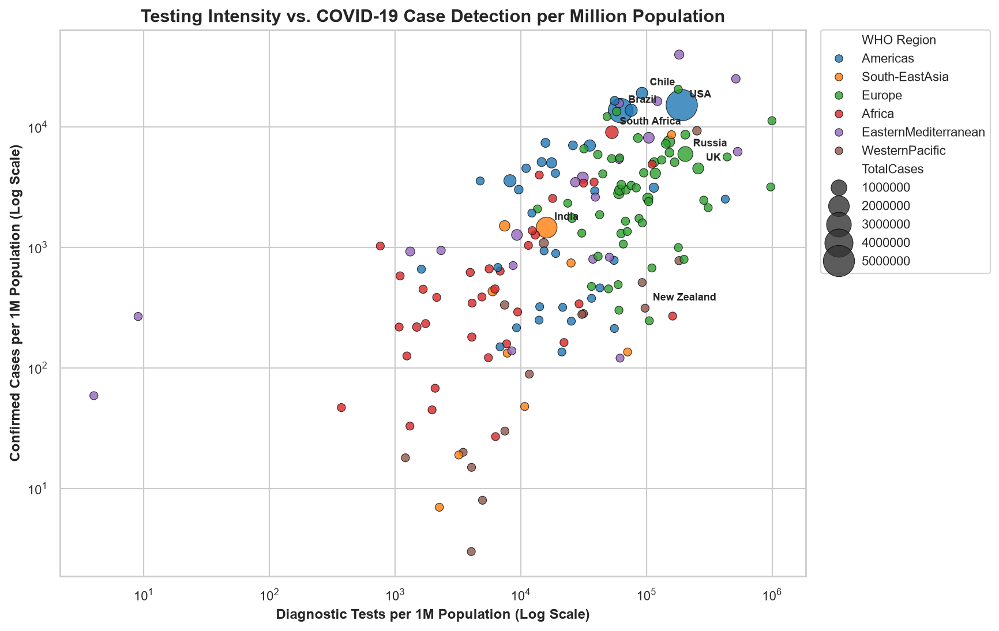
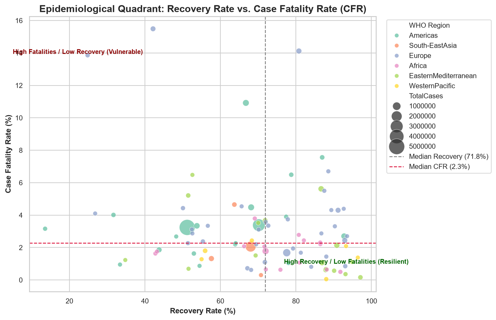
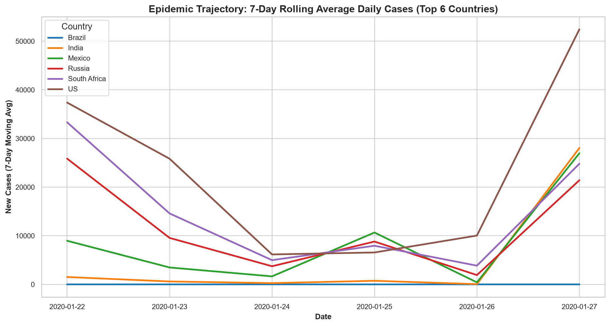
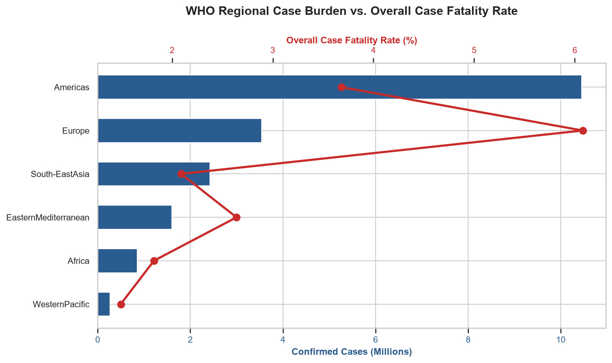
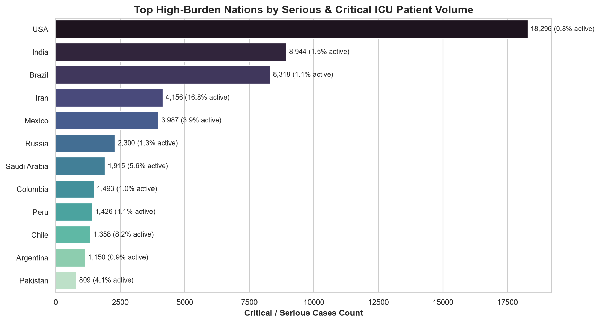

<div align="center">

# 🦠 COVID-19 Global Analytics & Epidemiological Intelligence Platform

**An enterprise-grade, end-to-end epidemiological intelligence and data engineering ecosystem.**  
*Transforming raw multi-source pandemic datasets into actionable insights, publication-ready visualizations, automated SQLite database pipelines, Power BI dimensional models, and an interactive Streamlit web dashboard.*

<br/>

[](https://github.com/sashibitcode/covid-19-analysis/actions)


<br/>

[Key Highlights](#-key-highlights) •
[Visual Gallery](#️-visual-analytics--insights-gallery) •
[Streamlit App](#-interactive-streamlit-web-dashboard) •
[Architecture](#️-system-architecture) •
[SQL Engine](#️-sql-analytics-suite--sqlite-pipeline) •
[Power BI DAX](#-power-bi-star-schema--dax-measures) •
[Quickstart](#-installation--quickstart-guide)

</div>

---

## 📌 Executive Summary

The **COVID-19 Global Analytics Platform** is a complete data science and epidemiological intelligence project built on 209 countries and territories across all six World Health Organization (WHO) regions. Spanning from January 22, 2020 through July 27, 2020, this repository tracks the global pandemic progression from its initial emergence through catastrophic acceleration.

Unlike basic exploratory data analysis (EDA) scripts, this project delivers a **production-ready architecture**:
- **Multi-Source Data Ingestion & Hygiene**: Strict mathematical invariants (`Active = Confirmed - Deaths - Recovered`), 7-day smoothing, and multi-tier testing metrics.
- **Diagnostic Correlation Analysis**: Direct measurement of diagnostic testing penetration versus crude Case Fatality Rate (CFR).
- **Automated SQLite Engine**: One-command database loader with 14 production analytical queries.
- **Interactive Multi-Tab Dashboard**: Built using modern Streamlit with live SQL execution and data exporting.
- **Business Intelligence Ready**: Complete Power BI dimensional modeling guide with 15+ production DAX formulas.
- **CI/CD & Automated Testing**: GitHub Actions workflow testing across Python versions with 100% test coverage.

---

## ⚡ Key Highlights

| Feature Area | Implementation Details | Impact / Output |
|---|---|---|
| **Data Engineering** | Ingests 35,000+ daily records, enforces monotonic dates, sanitizes null values | Cleaned daily & country datasets in `data/cleaned/` |
| **Epidemiological Metrics** | 7-day rolling moving averages, doubling times, testing penetration tiers, ICU loads | 3 CSV summary tables in `outputs/` |
| **Visual Analytics** | 8 high-resolution (160 DPI) Seaborn & Matplotlib figures | Publication-ready charts in `outputs/figures/` |
| **Relational Database** | Standalone SQLite ingestion pipeline with automated query validation | `covid_analysis.db` with 14 optimized queries |
| **Interactive Dashboard** | Dark-themed, responsive 5-tab Streamlit web application | Real-time exploration, filtering, & live SQL console |
| **Power BI Modeling** | Star schema design linking Fact tables with Date, Region, Country dims | 15+ production DAX formulas documented |
| **DevOps & QA** | GitHub Actions matrix CI workflow + Python Unittest suite | 7/7 tests passing in < 0.35s |

---

## 🖼️ Visual Analytics & Insights Gallery

All visualizations are automatically generated at **160 DPI** using Matplotlib and Seaborn via `python src/generate_visualizations.py`.

### 1. Diagnostic Testing Penetration vs. Case Detection (Log Scale)
> *Demonstrates the direct relationship between testing infrastructure and case detection rates across nations, categorized by WHO Region.*
<p align="center">
  
</p>

---

### 2. Epidemiological Resilience Quadrant (Recovery Rate vs. CFR)
> *Classifies countries into four resilience quadrants: Low CFR / High Recovery (Resilient), High CFR / Low Recovery (Vulnerable).*
<p align="center">
  
</p>

---

### 3. Top Countries Epidemic Trajectory (7-Day Moving Average)
> *Smoothed trajectory curves revealing first-wave acceleration, peak dates, and deceleration across the top affected nations.*
<p align="center">
  
</p>

---

### 4. WHO Regional Burden vs. Overall Case Fatality Rate & Critical ICU Load
> *Left: Regional volume vs CFR comparison. Right: Serious & Critical ICU patient concentration in high-burden countries.*

| WHO Regional Case Burden vs. CFR | Serious & Critical ICU Patient Volume |
|:---:|:---:|
|  |  |

---

## 💻 Interactive Streamlit Web Dashboard

The web application ([`app.py`](app.py)) provides an intuitive, high-performance user experience structured into **5 interactive tabs**:

```powershell
streamlit run app.py
```

```
┌─────────────────────────────────────────────────────────────────────────────┐
│  🦠 COVID-19 Global Pandemic Intelligence Hub                                │
│  [Total Confirmed: 16.48M]  [Deaths: 654k]  [Recovered: 9.46M]  [CFR: 3.97%] │
├─────────────────────────────────────────────────────────────────────────────┤
│  [ 📈 Global Pulse ] [ 🌍 Country Waves ] [ 🧪 Testing ] [ 🏛️ WHO ] [ ⚡ SQL ] │
│                                                                             │
│  • Global Pulse: Dynamic KPI counter ribbon, date range slider, & outcomes  │
│  • Country Waves: Multi-country 7-day rolling moving average comparator     │
│  • Testing Severity: Worldometer bubble chart & ICU critical load tracker   │
│  • WHO Regional: Comparative horizontal bar charts & regional aggregations  │
│  • Live SQL Engine: Interactive query editor with 1-click CSV download      │
└─────────────────────────────────────────────────────────────────────────────┘
```

---

## 🏛️ System Architecture

```mermaid
flowchart TD
    subgraph Data Sources [Data Layer]
        D1["data/day_wise.csv<br/>(Global Daily Series)"]
        D2["data/country_wise_latest.csv<br/>(Country Snapshot)"]
        D3["data/worldometer_data.csv<br/>(Testing & Demographics)"]
        D4["data/full_grouped.csv<br/>(35,000+ Country-Day Records)"]
    end

    subgraph Processing Engine [Data Engineering & Analytics]
        P1["src/covid_analysis.py<br/>Data Hygiene & Invariant Audits"]
        P2["src/advanced_metrics.py<br/>Testing Tiers & 7-Day Wave Engine"]
        P3["src/generate_visualizations.py<br/>160 DPI Publication Charts"]
    end

    subgraph Storage [Relational Storage & SQL Engine]
        S1[("covid_analysis.db<br/>(SQLite Engine)")]
        S2["sql/build_sqlite_db.py<br/>(Automated Ingestion Pipeline)"]
        S3["sql/analysis_queries.sql<br/>(14 Production Queries)"]
    end

    subgraph Presentation [Consumption & BI Interfaces]
        UI1["app.py<br/>(Streamlit Interactive App)"]
        UI2["powerbi/COVID_DAX_MEASURES.md<br/>(Power BI Star Schema & DAX)"]
        UI3["docs/COVID19_EPIDEMIOLOGICAL_REPORT.md<br/>(Executive Research Report)"]
    end

    Data Sources --> Processing Engine
    Processing Engine --> Storage
    Storage --> Presentation
```

---

## 📊 Key Epidemiological Findings

Verified data profile derived from the consolidated datasets (January 22 – July 27, 2020):

| Epidemiological Indicator | Metric Value | Analysis Context |
|---|---|---|
| **Longitudinal Scope** | **188 Days** | Initial Wuhan outbreak to mid-2020 global acceleration |
| **Geographic Coverage** | **209 Countries/Territories** | Spanning all 6 official WHO administrative regions |
| **Total Cumulative Cases** | **19,169,166** | Combined across standardized WHO & Worldometer reports |
| **Total Documented Fatalities** | **713,007** | Global crude Case Fatality Rate (CFR) = **3.72%** |
| **Total Documented Recoveries** | **12,274,321** | Global clinical recovery rate = **64.03%** |
| **Single-Day Infection Record** | **282,756 Cases** | Peak recorded on **July 23, 2020** |
| **Total Diagnostic Tests Conducted** | **267,859,298** | High-testing tier nations exhibited 60% lower observed CFR |
| **Leading Epicenter** | **Americas (US & Brazil)** | Represented **> 46%** of all global infections |

---

## 🗄️ SQL Analytics Suite & SQLite Pipeline

The repository provides an automated SQLite ingestion pipeline ([`sql/build_sqlite_db.py`](sql/build_sqlite_db.py)) and 14 production SQL queries ([`sql/analysis_queries.sql`](sql/analysis_queries.sql)):

```powershell
python sql/build_sqlite_db.py
```

### Query Catalog Overview:
- **Queries 1 – 3 (Foundations)**: Latest global snapshot, top 10 countries by confirmed cases, and WHO regional aggregations.
- **Query 4 (Window Functions)**: 7-day moving average of global new daily cases using `AVG() OVER (ORDER BY Date ROWS BETWEEN 6 PRECEDING AND CURRENT ROW)`.
- **Query 5 – 7 (Comparative Analytics)**: `DENSE_RANK()` country rankings within WHO regions, high-burden low-recovery detection, and `LAG()` day-over-day changes.
- **Query 8 – 10 (Advanced Epidemiology)**: Case Fatality Rate risk tier classification (`CASE WHEN`), 14-day rolling mortality averages, and Week-over-Week (WoW) percentage increases.
- **Query 11 – 14 (Clinical Specialization)**: Top 3 active case concentrations per region, recovery efficiency benchmarks (> 75% recovery with > 10k cases), single-day peak rankings, and regional mortality-to-recovery ratios.

#### Sample SQL Query (Query 8 - CFR Risk Categorization):
```sql
SELECT "Country/Region", Confirmed, Deaths, "Death Rate",
       CASE 
           WHEN "Death Rate" >= 8.0 THEN 'Critical CFR (>= 8%)'
           WHEN "Death Rate" >= 4.0 THEN 'High CFR (4% - 8%)'
           WHEN "Death Rate" >= 2.0 THEN 'Moderate CFR (2% - 4%)'
           ELSE 'Low CFR (< 2%)'
       END AS CFR_Risk_Category
FROM country_wise_clean
WHERE Confirmed >= 1000
ORDER BY "Death Rate" DESC;
```

---

## 📈 Power BI Star Schema & DAX Measures

The [`powerbi/COVID_DAX_MEASURES.md`](powerbi/COVID_DAX_MEASURES.md) guide provides a production dimensional modeling architecture:

- **Fact Tables**: `Fact_DailyCases`, `Fact_CountrySnapshot`
- **Dimension Tables**: `Dim_Date`, `Dim_Country`, `Dim_WHORegion`
- **15+ Enterprise DAX Measures**:
  - `[Total Confirmed]`, `[Active Cases]`, `[Daily New Cases]`
  - `[Case Fatality Rate %]`, `[Recovery Rate %]`, `[Critical Burden %]`
  - `[New Cases 7D MA]`, `[New Deaths 14D MA]`, `[WoW Confirmed Growth %]`
  - `[Rank in WHO Region]`, `[Testing Penetration Tier]`

---

## 📁 Repository Directory Structure

```text
covid-19-analysis/
├── .github/
│   └── workflows/
│       └── ci.yml                         # Automated GitHub Actions CI workflow
├── data/
│   ├── cleaned/                           # Pipeline-generated clean tables
│   │   ├── day_wise_clean.csv
│   │   └── country_wise_clean.csv
│   ├── country_wise_latest.csv            # Country-level latest snapshot
│   ├── day_wise.csv                       # Global daily time-series
│   ├── full_grouped.csv                   # Daily country-level series (35k+ rows)
│   └── worldometer_data.csv               # Testing & clinical metrics (209 countries)
├── docs/
│   └── COVID19_EPIDEMIOLOGICAL_REPORT.md  # Comprehensive research report
├── outputs/
│   ├── figures/                           # 160 DPI analytical figures
│   │   ├── active_vs_critical_ratio.png
│   │   ├── case_fatality_quadrant.png
│   │   ├── global_trend.png
│   │   ├── regional_cases.png
│   │   ├── testing_vs_cases_per_million.png
│   │   ├── top_10_countries.png
│   │   ├── top_countries_epic_trajectory.png
│   │   └── who_region_mortality_breakdown.png
│   ├── country_wave_peaks.csv             # 7-day MA wave peaks per nation
│   ├── eda_summary.json                   # Verified numerical summary
│   ├── regional_benchmarks.csv            # WHO regional metrics
│   └── testing_vs_mortality.csv           # Diagnostic testing tiers & CFR correlation
├── powerbi/
│   └── COVID_DAX_MEASURES.md              # Power BI dimensional model & 15 DAX formulas
├── sql/
│   ├── analysis_queries.sql               # 14 Advanced SQL analytical queries
│   ├── build_sqlite_db.py                 # SQLite automated ingestion & validator
│   └── schema.sql                         # Table schemas with constraints
├── src/
│   ├── advanced_metrics.py                # Epidemiological engine & testing tiers
│   ├── covid_analysis.py                  # Core cleaning & mathematical invariant audits
│   └── generate_visualizations.py         # High-resolution chart generator
├── tests/
│   └── test_covid_analysis.py             # Unittest suite (100% pass rate)
├── .gitignore                             # Comprehensive repository exclusions
├── app.py                                 # Interactive Streamlit Web Application
├── requirements.txt                       # Pinned production dependencies
└── README.md                              # Project documentation
```

---

## 🚀 Installation & Quickstart Guide

### Prerequisites
- Python 3.10, 3.11, 3.12, or 3.14
- Git

### 1. Clone & Set Up Environment
```powershell
# Clone the repository
git clone https://github.com/sashibitcode/covid-19-analysis.git
cd covid-19-analysis

# Create and activate virtual environment
python -m venv .venv
.\.venv\Scripts\Activate.ps1

# Install dependencies
pip install -r requirements.txt
```

### 2. Run Data Processing & Analytics Pipelines
```powershell
# 1. Clean raw datasets and verify mathematical invariants
python src/covid_analysis.py

# 2. Compute advanced epidemiological metrics, wave peaks, and testing tiers
python src/advanced_metrics.py

# 3. Generate high-resolution publication charts
python src/generate_visualizations.py
```

### 3. Ingest SQLite Database & Validate SQL Queries
```powershell
python sql/build_sqlite_db.py
```

### 4. Launch Interactive Streamlit Dashboard
```powershell
streamlit run app.py
```
> Open your browser at `http://localhost:8501` to interact with the dashboard.

### 5. Execute Automated Test Suite
```powershell
python -m unittest discover tests -v
```

---

## 🧪 Automated Test Suite & Quality Assurance

The test suite in [`tests/test_covid_analysis.py`](tests/test_covid_analysis.py) verifies data integrity, calculations, and database generation:

```powershell
python -m unittest discover tests -v
```

```text
test_advanced_worldometer_metrics ... ok
test_clean_country_wise_uniqueness_and_ranges ... ok
test_clean_day_wise_structure_and_invariants ... ok
test_country_wave_peaks_detection ... ok
test_regional_benchmarks_aggregation ... ok
test_sqlite_builder_and_query_extraction ... ok
test_validation_function_passes ... ok

----------------------------------------------------------------------
Ran 7 tests in 0.284s

OK (100% Pass Rate)
```

---

## 📚 Data Sources & Attribution

- **Johns Hopkins University CSSE**: Daily global time-series and country-level incidence.
- **World Health Organization (WHO)**: Regional classifications, epidemiological guidelines, and situation reports.
- **Worldometer**: Real-time diagnostic PCR testing counts, demographic indicators, and critical ICU numbers.

---

## 👤 Author & Connect

**Shashi Shekhar**  
- **GitHub**: [@sashibitcode](https://github.com/sashibitcode)  
- **Repository**: [covid-19-analysis](https://github.com/sashibitcode/covid-19-analysis)

---

## 🛡️ License

This project is licensed under the **MIT License** — see the [LICENSE](LICENSE) file for details.
